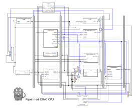

# ECS 154B Lab 2, Winter 2019

**Due by 12:00 AM on February 4, 2019**

*Turn in via Gradescope*.
[See below for details.](#Submission)

# Table of Contents

# Introduction


In the last assignment, you implemented a full single cycle RISC-V CPU.
In this assignment, you will be extending this design to be a 5 stage pipeline instead of a single cycle.
You will also be implementing full forwarding for ALU instructions, hazard detection, and an always not taken branch predictor.
The simple in-order CPU design is based closely on the CPU model in Patterson and Hennessey's Computer Organization and Design.

This is the first time we have used this set of assignments, so there may be mistakes.
To offset this, we will be offering a variety of ways to get extra credit.
See [the extra credit page](../extra-credit.md) for an up-to-date list of ways to get extra credit.
*I want to involve **you** in the development of these assignments.*
Who knows better than you how to improve these assignments!

## Updating the DINO CPU code

Follow the same steps as in [lab 2](../lab2.md#updating-the-dino-cpu-code).

## How this assignment is written

The goal of this assignment is to implement a pipelined RISC-V CPU which can execute all of the RISC-V integer instructions.
Like the previous assignment, you will be implementing this step by step starting with a simple pipeline in [Part 1]() and building to adding forwarding, branch prediction, and hazard detection.

If you prefer, you can simply skip to the end and implement all of the instructions at once, then run all of the tests for this assignment via the following command.
You will also use this command to test everything once you believe you're done.

```
sbt:dinocpu> test
```

We are making one major constraint on how you are implementing your CPU.
**You cannot modify the I/O for any module**.
We will be testing your control unit with our data path, and our data path with your control unit.
Therefore, you **must keep the exact same I/O**.
You will get errors on Gradescope (and thus no credit) if you modify the I/O.

## Goals

- Learn how to implement a pipelined CPU.
- Learn what information must be stored in pipeline registers.
- Learn which combinations of instructions cause hazards and which can be overcome with forwarding.

# Pipelined CPU design




