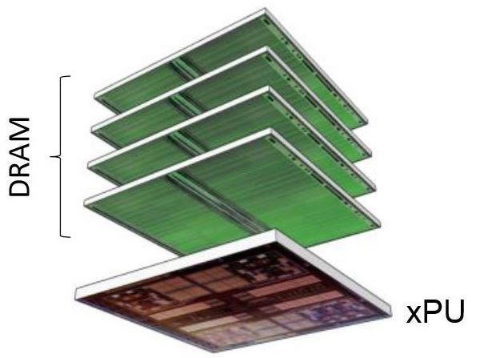

# Memory System Architecture

In this section, we're going to learn about what I believe is the most important part of the computer's architecture: the memory system.
Moving data from point A to point B is one of the main bottlenecks in all of today's systems.
Shown above is a picture of HBM (high-bandwidth memory) which is a relatively new memory technology primarily used in GPUs and other accelerators to try to overcome this memory bottleneck.

## Memory intro and Technology

In this section, we'll be talking about how memory *works* and [memory technology](./technology.md).
We'll find that while there are many different memory technologies, none are "best".

* [Memory intro and technology](./technology.md)
  * [Introduction: Why does memory architecture matter? **VIDEO**](./technology.md#introduction-why-does-memory-architecture-matter-video-)
  * [Memory technology **VIDEO**](./technology.md#memory-technology-video-)
  * [Moving data around **VIDEO**](./technology.md#moving-data-around-video-)
  * [**QUIZ** Memory technology](./technology.md#quiz-memory-technology)

## Caches and the Memory Hierarchy

Since no one technology is the best, we want to create a memory hierarchy with [caches](./caches.md).
We will discuss the underlying principles that make caches efficient, and how hardware caches are designed.

* [Caches and the Memory Hierarchy](./caches.md)
  * 

### [Assignment 4](https://github.com/jlpteaching/dinocpu-sq20/blob/master/assignments/assignment-4.md) **DUE 5/25**

## Virtual memory

Finally, we'll step up a level and look at how operating systems allow multiple programs to share a single memory through [virtualization](./virtual.md).

* [Virtual memory](./virtual.md)
  * 

## Summary

* [Summary](./summary.md)
  * 

[Up next: Parallel Architecture.](../parallel/index.md)
