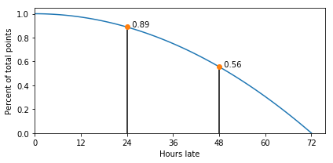

ECS 154B - Computer Architecture
================================

* [Important Information](#important-information)
    * [Time and Location](#time-and-location)
    * [Instructor](#instructor)
    * [Teaching Assistants](#teaching-assistants)
    * [GitHub](#github)
    * [Canvas](#canvas)
    * [Gradescope](#gradescope)
    * [Piazza](#piazza)
    * [Regrade Requests](#regrade-requests)
    * [Accommodations](#accommodations)
* [Academic Misconduct](#academic-misconduct)
* [Student support](#student-support)
* [Prerequisites](#prerequisites)
* [PTAs](#ptas)
* [Assignments and Tests](#assignments-and-tests)
    * [Grading Breakdown](#grading-breakdown)
    * [Participation](#participation)
    * [Labs](#labs)
       * [Late Assignments](#late-assignments)
    * [Tests](#tests)
* [Reading List and Schedule](#reading-list-and-schedule)
    * [Textbook](#textbook)
    * [Schedule](#schedule)

Important Information
---------------------

### Time and Location

*Lecture*: **Chemistry 176** 11:00 AM - 11:50 AM MWF

*Discussion*: **Olson Hall 6** 3:10 PM - 4:00 PM Thursday

### Instructor

**Professor Jason Lowe-Power** (<jlowepower@ucdavis.edu>)

*Office Hours*: 4:00 PM - 6:00 PM Wednesday, or by appointment.

*Office Location*: 3049 Kemper Hall

Please suggest a meeting time when you email me for an appointment.
You can use [my calendar](http://goo.gl/hmtAH) to quickly find a time I am available.
It's not guaranteed to be completely up-to-date, but it gives a good starting point.

### Teaching Assistants

#### Justin Perona (<jlperona@ucdavis.edu>)

This is my 8th time TAing for ECS 154B, from 2015 until now.
In addition, I taught (as the instructor) ECS 154A in Summer Session II 2018.

*Office Hours*: 2:10 - 3:00 PM Friday

*Office Location*: 3039 Kemper

#### Filipe Eduardo Borges (@ucdavis.edu)

<Insert short bio here>

*Office Hours*: TBA

*Office Location*: TBA

### GitHub

We will use [GitHub](https://github.com/jlpteaching/ECS154B) as the main website and entry point for all course information.
The version of documents found on GitHub are the canonical versions of all documents.
Other downloaded versions of documents may become out of date.
If I make changes to those documents, they will appear first on GitHub.

GitHub will contain this document and the assignments.

### Canvas

We will be using [Canvas](https://canvas.ucdavis.edu/courses/315466) for grade distribution.

### Gradescope

We will use [Gradescope](https://www.gradescope.com/courses/35106) for all assignments including lab submissions and returning quizzes, the midterm, and the final.
Gradescope gives you a graded PDF version of your test, along with a rubric, immediately after we're done grading.
You will receive an email from Gradescope to make your account early in the quarter.

All lab assignments will be autograded by Gradescope.
When you upload your code to Gradescope, a set of tests will be run on it and your grade *will be immediately available*.
You may submit your code any number of times.
Only the final submission will be accepted as the grade for your assignment.
However, if you submit after the deadline, the [late policy](#Late-Assignments) applies.

### Piazza

We will use [Piazza](https://piazza.com/class/jqitg8o5zp125) for class discussions outside of the classroom.
If you haven't used Piazza before, it's a cool tool that is essentially a message board for the class.
Both the TAs and I will be on Piazza to answer questions.

It's best to ask your questions on Piazza.
That way, all of your classmates can see the answer instead of emailing the TAs or me.
Additionally, you might get a much faster response from one of your classmates!
Through asking and answering questions on Piazza, you improve your understanding of the material, and improve other students' understanding as well.

In the spirit of the above, please ask questions as public questions on Piazza, if possible.
This way, your question, and the answer to your question, can help somebody else who might have the same question.
We will change questions asked privately to public, if we deem it appropriate.
If your question involves code you've written, or is about a personal issue, we will leave those private.

10% of your grade is tied to participation, much of which will take place over Piazza.
The benchmark for good Piazza participation is at least 10 questions asked, answered, or follow-ups throughout the quarter.

### Regrade Requests

Regrade requests must be made within one week of the return of the assignment or test.
Regrade requests should be made in person, in office hours or by appointment.

### Accommodations

The exam schedule is available on the [schedule](schedule.csv).
Per [official UC Davis policy](http://catalog.ucdavis.edu/academicinfo/exams.html), if you have an accommodation request from the [Student Disability Center](https://sdc.ucdavis.edu/), or have any conflicts with exam times for religious observances, you must notify me **by the fourth class, January 14, 2018**.

Academic Misconduct
-------------------

Academic misconduct is a serious issue.
You can find the official UC Davis policy on the [Office of Student Support and Judicial Affairs](http://sja.ucdavis.edu/) website.

You are expected to *cite all of the work you reference*.
Any ideas that are not specifically yours or generally known (e.g., caches hold data) should have a citation.
When in doubt, cite.

Any violations of this policy will result in reporting the violating student(s) to the Office of Student Support and Judicial Affairs.
This can result in a 0 on the assignment or an F in the class.

Student Support
---------------

As a student you may experience a range of issues that can cause barriers to learning, such as strained relationships, increased anxiety, alcohol/drug problems, feeling down, difficulty concentrating and/or lack of motivation.
These mental health concerns or stressful events may lead to diminished academic performance or reduce a student’s ability to participate in daily activities.
UC Davis is committed to advancing the mental health and well-being of its students.
If you or someone you know is feeling overwhelmed, depressed, and/or in need of support, services are available.
You can learn more about the broad range of confidential mental health services available on campus via [Student Health and Counseling Services](https://shcs.ucdavis.edu/).

You can also contact me during office hours, via email, or by making a separate office hour appointment: [jlowepower@ucdavis.edu](mailto:jlowepower@ucdavis.edu).

Prerequisites
-------------

ECS 154A; or both EEC 170 and EEC 180A.

PTAs
----

Before asking for a PTA, be sure that you have read the [Computer Science Department's PTA Policy](http://www.cs.ucdavis.edu/blog/pta-policy/).
PTA numbers will only be issued after the 12th day of instruction, and PTA numbers are only issued for extenuating circumstances related to graduation.

Assignments and Tests
---------------------

### Grading Breakdown

|Category     |Percentage|
|-------------|---|
|Participation|10%|
|Labs (5x)    |40%|
|Midterm (2x) |30%|
|Final        |20%|

### Participation

10% of your grade comes from actively participating in class (defined broadly).
You are expected to participate on [Piazza](https://piazza.com/class/jqitg8o5zp125) (e.g., at least 10 contributions), lecture discussions, discussion section discussions, **or** office hours.

### Labs

You will complete five lab assignments throughout this course.
The labs can be found via the links below.
All together, the labs are worth 40% of your final grade.
Each lab is weighted based on the amount of time you are given to complete the lab.

Labs are due at 12 AM (midnight) on Sunday night / Monday morning.

-   [Lab 1](https://github.com/jlpteaching/ECS154B/blob/master/lab1/lab1.md) (2 weeks, 8%). Due January 21.
-   [Lab 2](https://github.com/jlpteaching/ECS154B/blob/master/lab2/lab2.md) (2 weeks, 8%). Due February 4.
-   [Lab 3](https://github.com/jlpteaching/ECS154B/blob/master/lab3/lab3.md) (2 weeks, 8%). Due February 18.
-   [Lab 4](https://github.com/jlpteaching/ECS154B/blob/master/lab4/lab4.md) (2 weeks, 8%). Due March 4.
-   [Lab 5](https://github.com/jlpteaching/ECS154B/blob/master/lab5/lab5.md) (2 weeks, 8%). Due March 15, which is a **Thursday night midnight / Friday morning**.

#### Late Assignments

If you turn in a lab late, you will lose points.
The percentage of points you will lose is given by the equation below.
This will give you partial points up to 72 hours after the due date and penalizes you less if you barely miss the deadline.

Note: When submitting late, the reduction in points will not immediately appear in Gradescope.
Rest assured, we will go through and double check all of the submission times ;).

### Tests

Note that for each test, there will be a practice test available at least four days in advance.
The practice test will have similar questions to the actual tests.

The two midterms will be held during the discussion time and will be 50 minute tests.

The final will be cumulative during the final time and will use the full 2 hours.

#### Midterm 1: January 31

You are allowed **one** 8.5" x 11" sheet of *handwritten* notes.

The first midterm will cover technology, performance and CPU design basics.

#### Midterm 2: February 28

You are allowed **one** 8.5" x 11" sheet of *handwritten* notes.

The second midterm will cover pipelined CPU design, memory technology, and memory hierarchy.

#### Final: Tuesday, March 20, 2018 at 1 AM

You are allowed **two** 8.5" x 11" sheets of *handwritten* notes.

The final will be cumulative with a focus on coalescing the knowledge gained throughout the quarter.

Reading List and Schedule
-------------------------

### Textbook

In this class, we'll be closely following *Computer Organization and Design RISC-V Edition: The Hardware/Software Interface* by D. A. Patterson and J. L. Hennessy.

Importantly, you should get the *RISC-V edition*, not the ARM edition and not the MIPS edition. This is different from versions in years past.
The correct version is white with a picture of an abacus on a tablet.

Additionally, you may find *The RISC-V Reader: An Open Architecture Atlas* a useful companion, but this book is not required.
We will be implementing a RISC-V processor in this class and having a physical book with the RISC-V instructions described will be useful.
If you prefer to not buy yet another book (though I do think it's a useful book to have), you can also use the online version of [the RISC-V specification](https://riscv.org/specifications/).
Note: the specification has fewer pretty pictures than the book.

You can find these books at the [university bookstore](http://ucdavisstores.com/SelectTermDept) or through various sites online.

### Schedule

<https://github.com/jlpteaching/ECS154B/blob/master/syllabus/schedule.csv>
