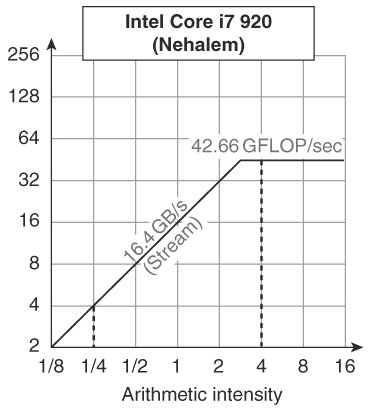

# Written problems for week 6

This problem set covers lectures 15 through 17.

Solutions won't be posted on GitHub.
If you'd like answers to the problems, either post on Piazza or go to Jason's or Justin's office hours.

## Lectures

15. [Instruction-level parallelism](https://github.com/jlpteaching/ECS154B/blob/master/lecture%20notes/02-11-Lecture-15.pdf)
16. [Dynamic ILP and real systems](https://github.com/jlpteaching/ECS154B/blob/master/lecture%20notes/02-13-Lecture-16.pdf)
17. [Memory technology](https://github.com/jlpteaching/ECS154B/blob/master/lecture%20notes/02-15-Lecture-17.pdf)

## Topics covered

* Instruction-level parallelism (ILP)
    * Definition and finding ILP
    * Static ILP
        * Loop unrolling
        * VLIW and EPIC
        * SIMD
        * Multiple-issue
    * Dynamic ILP
        * Dependencies
        * Out-of-order
        * Register renaming
    * Roofline model
* Memory
    * Characteristics
    * SRAM and DRAM

## Problems

### Instruction-level parallelism (ILP)

1. What is ILP? Can we consider pipelining a form of ILP?
2. What do we need instructions to be so that we may execute them in parallel? Why is this difficult to find statically in the compiler? What is the potential problem of doing so dynamically?
3. Why does loop unrolling expose more ILP in loops? What is the cost of implementing loop unrolling? (Hint: look at the registers used when we unroll a loop further.)
4. VLIW (and EPIC, which builds on top of VLIW) architectures encode what each functional unit is doing in the instruction. Is this done statically or dynamically? On average, will we be able to fill every slot with an instruction?
5. What does SIMD stand for? When we run a SIMD instruction, what happens to every piece of data run with the instruction?
6. What is a multiple-issue machine? What changes do we need to make to the register file and pipeline registers in order to implement this?
7. Why do we not need to worry about WAR and WAW hazards in a normal in-order pipeline?
8. Why does register renaming break WAR and WAW dependencies? What additional structure(s) do we need in order to implement register renaming?
9. Using the following code block from the previous week's questions, answer the following questions.
    1. Indicate all the WAR and WAR hazards.
    2. In the previous week's questions, you rescheduled this code to remove hazards. Looking back at your answer, is it still correct given your knowledge of these hazards? If not, reschedule the code to respect the WAR and WAW dependencies.
    3. Assume we executed this code block in an out-of-order pipeline that implemented register renaming. In what order(s) do we issue, execute, and commit these instructions?

```
0:    lw   x5, 0(x2)
4:    lw   x2, 4(x6)
8:    add  x3, x2, x1
12:   sw   x3, 20(x9)
16:   sub  x8, x7, x8
20:   and  x8, x8, x5
```

10. Using the following code block from the previous week's questions, answer the following questions.
    1. Why is there a potential dependency between instructions 8 and 12? (You may want to check your answer to last week's problem 12.a after answering this question.)
    2. Is it possible to know this dependency statically, i.e. at compile time? Why or why not?
    3. Is it possible to know this dependency dynamically, i.e. at execution? Why or why not?

```
0:    add  x3, x1, x2
4:    bne  x3, x4, 16
8:    lw   x5, 124(x7)
12:   sw   x6, -32(x8)
16:   add  x4, x1, x3
20:   ...
```

11. Using the roofline model for Intel's Core i7 920 below, for what values of arithmetic intensity are we limited by memory bandwidth?



### Memory

12. Imagine that you are shopping for a new hard drive (or solid-state drive) for your laptop. What characteristics would you care about when comparing between the options available?
13. Now imagine that you're part of a design team at a data storage company, tasked with designing a new hard drive for use in data centers. What characteristics would you care about (that your corporate clients would care about) when designing this hard drive?
14. Caches on a CPU need to be accessed very quickly in order to (try to) resolve memory accesses on a CPU as soon as possible. Would using SRAM or DRAM be more appropriate in this use case?
15. What is the downside of using your answer to the previous question? How does this impact the CPU that we would implement using that memory technology for the caches?
